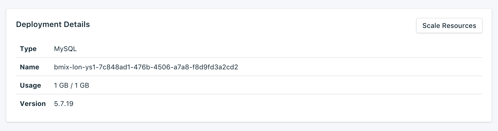

---

Copyright:
  Years: 2017
lastupdated: "2017-07-13"
---

{:new_window: target="_blank"}
{:shortdesc: .shortdesc}
{:screen: .screen}
{:codeblock: .codeblock}
{:pre: .pre}

# Service Overview

The _Overview_ page shows you information about your Bluemix Compose database. The overview includes essential identifying information and current resource usage. You'll also find a section for connection strings that you can use with tools or make use of tools to connect to your database.

## Deployment Details

The _Deployment Details_ panel shows details of your service.

### Type

The type of database that is offered by the service; in this case `MySQL`.

### Name

An internal identifier for the service.

### Usage

The size of your database and the amount of storage provided by your service plan.

### Version

The database version that your service uses.

### Scale Resouces

If your service needs additional storage, or you want to reduce the amount of storage allocated to your service, you can do this by scaling resources. See [Scaling Resources](./dashboard-scaling-resources.html) for more details.

## Connection Strings

Connection Strings can be used by some client libraries and contain all the information needed for other libraries to connect. You can find out how to use a Connection String to connect to your service in [Connecting an external application](./connecting-external.html).

You'll find each Connection String for your service in a different tab in the _Connection Strings_ panel.

### Connection String

The **Connection String** can be used by some client libraries and contains all the information needed for other libraries to connect. You can find out how to use the Connection String to connect in [Connecting an external application](./connecting-external.html).

### Command Line

The **Command Line** is a preformatted command you can use to connect to MySQL. To do so, you have to install MySQL on your local machine. You can find out about how to use it in [Connecting an external application](./connecting-external.html).

### SSL Certificate

Your Compose Bluemix service provides you with an SSL certificate that you can use to connect to your database.