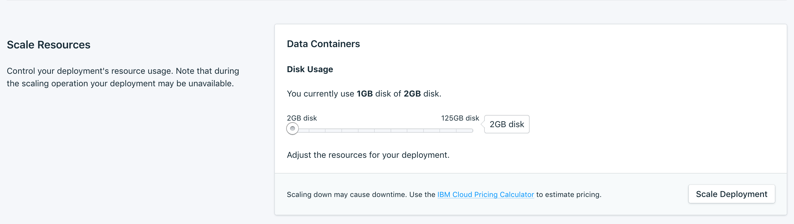

---

Copyright:
  years: 2017,2018
lastupdated: "2017-11-20"
---

{:new_window: target="_blank"}
{:shortdesc: .shortdesc}
{:screen: .screen}
{:codeblock: .codeblock}
{:pre: .pre}
{:tip: .tip}

# Settings

Use these features to adapt your {{site.data.keyword.composeForMySQL_full}} service to better suit your needs and requirements.

## Upgrade Version

If a new version of the database is available, a drop-down menu appears, from which you can select the version that you want to upgrade to. Otherwise, your service is on the newest version available, and the panel displays the current version information.

## Scaling Resources

You can increase or reduce the amount of storage that is allocated to your service by scaling resources.

1. Go to your service's _Overview_ page.
2. In the _Deployment Details_ panel, click **Scale Resources**. The Scale Resouces page opens.

  

3. Adjust the slider to increase or reduce the storage that is allocated to the {{site.data.keyword.composeForMySQL}} service. Move the slider to the left to reduce the amount of storage, or move it to the right to increase the storage.
4. Click **Scale Deployment** to trigger the rescaling and return to the dashboard overview.

When the scaling is complete the _Deployment Details_ pane updates to show the current usage and the new value for the available storage.

## Updating the Service Password

You might find it necessary to change the password of your service.

1. Go to the _Change Password_ panel. 

  You can use the randomly generated password that is created for you, or you can type your own password into the field. To regenerate a new random password, click the dice. 
  
  

2. Click **Update Password**. You are asked to confirm the change.
3. Click **Update Password** in the dialog to confirm the new password, or click **cancel** to cancel the change. The _Deployment Details_ pane shows the progress of the running job.

**Note:** Changing the password changes the credentials that you and your services use to connect, and invalidates your service's connection string. It can also result in downtime.

### Updating Connected Applications

Changing the password invalidates the existing connection string and generates a new one. This will cause a service interruption until connected applications are updated with the new connection string. You will have to do this by supplying the new connection string to your applications.

For more information about connecting your applications, see [Connecting an {{site.data.keyword.cloud}} Application](./connecting-bluemix-app.html), and [Connecting an external application](./connecting-external.html).

## Using Whitelists

If you want to restict access to your databases, you can whitelist specific IP addresses or ranges of IP addresses on your service. When the whitelist contains no IP addresses, the whitelist is disabled and the deployment accepts connections from any system on the internet.

### IP addresses
The *IP* field can take a single complete IPv4 address or IPv6 address with or without a netmask. Without a netmask, incoming connections must come from exactly that IP address. 

**Note:** Although the *IP* field allows for IPv6, no Compose deployments are currently available to IPv6 networking and so these addresses cannot be filtered on.

### Netmask
s
To allow a connection from a specified range of IP addresses, use a netmask. The IP address must be fully specified when using a netmask. That means entering, for example, 192.168.1.0/24 rather than 192.168.1/24.

### Description

The *Description* can be any user-significant text for identifying the whitelist entry - a customer name, project identifier, or employee number, for example. The description field is required.

### Compose Services

Whitelist entries are automatically added to Compose's servers to allow them to connect.

### Removal

To remove an IP address or netmask from the Whitelist, click *Remove*.

When all entries on the whitelist are removed, the whitelist is disabled and all IP addresses are accepted by the TCP access portals.
